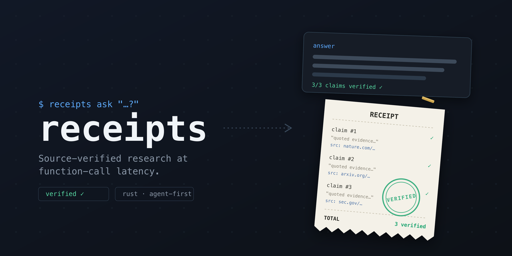

<p align="center">
  
</p>

<h1 align="center">receipts</h1>

<p align="center"><b>Source-verified research at function-call latency.</b><br>
Ask a question, get back claims. Every claim carries a source URL, a quote, and a verdict.</p>

<p align="center">
  <a href="https://crates.io/crates/receipts"></a>
  <a href="https://github.com/treygoff24/receipts/actions/workflows/ci.yml"></a>
  <a href="LICENSE"></a>
</p>

> 🤖 **Are you an agent?** Skip the sales pitch and read [AGENTS.md](AGENTS.md) — it has the install one-liner, the env vars your human needs to set, and the full machine contract.

---

LLMs answer confidently whether or not a source exists. `receipts` is the antidote: a CLI that decomposes your question, fans out real web searches, reads the sources, and returns only claims it can pin to a URL and a quote. When it can't verify something, it says so in a structured `uncertainties` field instead of guessing.

It's built agent-first, which makes it unusually pleasant for everyone:

```sh
receipts "Did the EU AI Act's GPAI obligations take effect in 2025?"
```

```json
{
  "schema": "receipts.cli.response.v1",
  "ok": true,
  "data": {
    "outcome": "answered",
    "claims": [
      {
        "claim": "The EU AI Act's obligations for general-purpose AI models applied from 2 August 2025.",
        "sourceUrl": "https://artificialintelligenceact.eu/implementation-timeline/",
        "quote": "2 August 2025: ... obligations for providers of general-purpose AI models enter into application.",
        "verdict": "supported",
        "published": "2025-08-02"
      }
    ],
    "searchTrail": [{ "query": "EU AI Act GPAI obligations effective date", "results": 6 }],
    "uncertainties": []
  },
  "costDollars": { "total": 0.13, "estimated": false },
  "diagnostics": { "durationMs": 12100 }
}
```

Twelve seconds, thirteen cents, and an answer you can cite. That speed comes from Cerebras inference (fast open-weight models) driving Exa search in parallel, with a verification pass that re-reads each source before a claim earns its `supported` verdict.

The whole tool is honest about being a tool. Stdout is reserved for result envelopes and stderr for error envelopes. There are no prompts, colors, spinners, or interactive fallbacks. Exit codes are a contract. It can describe its own capabilities and schemas on request, price a query before spending (`--dry-run`), and stop cleanly at a dollar or time budget you set.

## Install

Homebrew (macOS/Linux):

```sh
brew install treygoff24/tap/receipts
```

Shell installer (macOS/Linux):

```sh
curl --proto '=https' --tlsv1.2 -LsSf https://github.com/treygoff24/receipts/releases/latest/download/receipts-installer.sh | sh
```

Cargo:

```sh
cargo install receipts          # from crates.io
cargo binstall receipts        # prebuilt binary, no compile
```

Then set two keys and verify:

```sh
export CEREBRAS_API_KEY=...    # https://cloud.cerebras.ai
export EXA_API_KEY=...         # https://exa.ai
receipts doctor --online
```

## Usage

```sh
receipts "your question"                              # standard depth, ~$0.15
receipts --depth quick ask "cheap fact check"         # ~$0.05–0.10, ~10s
receipts --depth deep ask "contested question"        # ~$0.31, refinement + adaptive verification
receipts --max-dollars 0.10 ask "capped question"     # hard spend cap, partial results if hit
receipts --dry-run ask "how much would this cost?"    # price it, no keys needed, spends nothing
```

| Tier | Workers | Latency | Cost | Notes |
| --- | ---: | --- | --- | --- |
| quick | 2 | ~10s | ~$0.05–0.10 | same question, complementary search angles |
| standard | 4 | ~9–15s | ~$0.15 | default |
| deep | 8 | ~9s | ~$0.31 | refinement pass and adaptive verification |

Budget caps (`--max-dollars`, `--max-seconds`) stop new work, drain in-flight calls, and return a partial envelope when useful claims exist. A budget-hit partial exits 10 with the success envelope on stdout, because partial verified research is still usable research.

## Environment

| Variable | Required for | Default |
| --- | --- | --- |
| `CEREBRAS_API_KEY` | `ask`, `doctor --online` | none |
| `EXA_API_KEY` | `ask`, `doctor --online` | none |
| `RECEIPTS_MODEL` | model default | `gemma-4-31b` |
| `RECEIPTS_API_BASE` | Cerebras compatible API base | `https://api.cerebras.ai/v1` |
| `RECEIPTS_EXA_BASE` | Exa compatible API base | `https://api.exa.ai` |
| `RECEIPTS_EXA_SEARCH_TYPE` | Exa search type: `fast`, `instant`, or `auto` | `fast` |
| `RECEIPTS_MAX_CONCURRENCY` | worker concurrency | `25` |

## The contract

`receipts --json` forces the machine envelope; without it, a terminal gets the same JSON (there is no separate human renderer yet). Success envelopes are `receipts.cli.response.v1` on stdout; errors are `receipts.cli.error.v1` on stderr with stdout left empty.

### Exit codes

| Code | Meaning | Channel and shape |
| ---: | --- | --- |
| 0 | ok | success envelope on stdout |
| 1 | usage | error envelope on stderr |
| 2 | auth | error envelope on stderr; `doctor` reports structured checks on stdout |
| 3 | config | error envelope on stderr |
| 4 | network | error envelope on stderr |
| 5 | upstream | error envelope on stderr |
| 6 | rate limit | error envelope on stderr |
| 10 | partial | success envelope on stdout with `data.outcome: "partial"` and `budget.hit` set |
| 11 | no input | error envelope on stderr |

### Self-description

```sh
receipts capabilities   # version, commands, spend annotations, exit codes, env vars, unit costs
receipts schema all     # JSON Schema for the success and error envelopes
receipts doctor         # offline config/credential checks; --online adds live provider probes
```

`doctor` never prints secret values. Missing or bad credentials exit 2 and name the provider plus the env var to set.

## Why "receipts"

Because that's what you get. Every claim in the output either has a source URL and a supporting quote, or it's listed under `uncertainties` where it belongs. No vibes, no confident hallucination, no "as an AI I believe." Receipts.

## Development

```sh
cargo test && cargo clippy --all-targets && cargo fmt --check
```

Design docs live in [`docs/plans/`](docs/plans/). Contributions welcome — see [CONTRIBUTING.md](CONTRIBUTING.md).

## License

Apache-2.0
